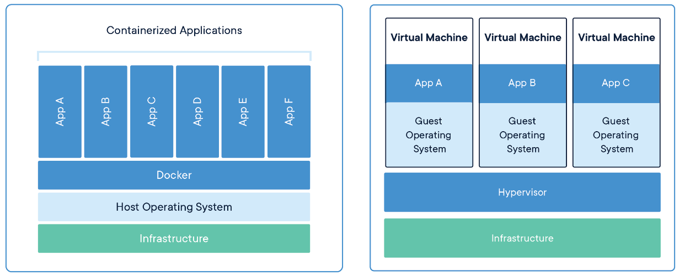
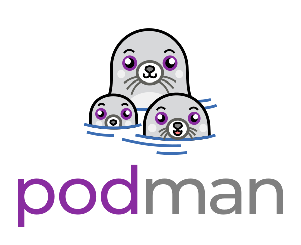
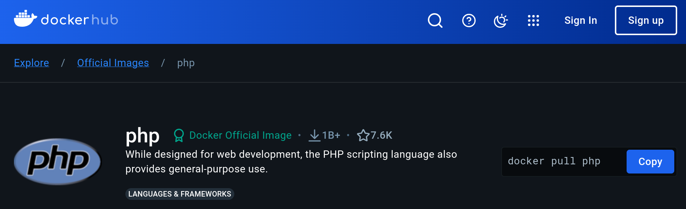

# Da applicazione <br /> a container

## Dev Room
## Meeting Eroi Digitali 2024

---
layout: section
---

# Cos'è un container?

---

# Come funzionano i container?

Un container è approssimabile a una macchina virtuale, ma con alcuni punti chiave:

- Sono solitamente progettati per eseguire un singolo processo
- Hanno un' immagine di partenza, la quale è la parte statica del container
- È possibile agganciare dello storage esterno
- Si possono esporre delle porte per comunicare con l'esterno (port forwarding)
- È possibile aggiungere variabili d'ambiente

<!--
Non sempre girano un solo processo, magari ce ne sono di più, ma è una pratica comune quella di avere un container per "contesto" (es. un container per il database, un container per il web server, un container per l'applicazione)

L'immagine di partenza è statica perché è la parte "sacrificabile" del container, è la parte che si può distruggere e ricreare senza problemi

Lo storage esterno può essere un volume, una directory, un socket, un file, ecc.
-->

---
layout: quote
---

# A container is a standard unit of software that packages up code and all its dependencies so the application runs quickly and reliably from one computing environment to another.

_**Fonte:** [Docker](https://www.docker.com/resources/what-container)_

### Di fatto, un container è un modo per isolare un'applicazione e le sue dipendenze in un ambiente controllato e riproducibile.

<!--
Se vogliamo fare il deploy di una applicazione tramite una VM, la dimensione del disco e le risorse necessarie sono molto maggiori rispetto a un container (journaling, systemd, ecc.)
-->

---

# Perché usare i container?

Cosa ci spinge a usare tale tecnologia?

- **Isolamento**: ogni container è isolato dagli altri
- **Riproducibilità**: un container è riproducibile ovunque
- **Portabilità**: dato che è uno standard, è possibile eseguirlo ovunque

<div class="px-25 pt-3">
  
</div>

<!--
L'isolamento è comodo perché possiamo avere più versioni di una stessa applicazione senza che si interferiscano tra di loro

La riproducibilità è utile per la creazione di ambienti di sviluppo, test e produzione

Per portabilità si intende che un container può essere eseguito su qualsiasi sistema che supporti i container, indipendentemente dal sistema operativo. La sua dimensione ridotta lo rende facilmente trasportabile
-->

---
layout: statement
---

## Il 90% delle applicazioni di cui abbiamo necessità sono già fruibili attraveso i container.

<div class="flex gap-4 justify-center text-4xl my-3">
  <VClicks>
    <LogosUbuntu />
    <LogosDrupalIcon />
    <LogosPython />
  </VClicks>
</div>

<v-click>

## Quasi tutte le applicazioni pubblicate oggi hanno come metodo di distribuzione i container.

</v-click>

---
layout: section
---

# Come si crea un container?

---

# Bellissima introduzione, ma come si fa?

Io ho già la mia app...

<VClicks>

Vediamo l'applicazione che vogliamo containerizzare.

Bisogna analizzare la nostra applicazione e capire quali sono le sue necessità:

</VClicks>

<VClicks>

- **Runtime**: quale runtime necessita la nostra applicazione? PHP, Python, Node.js, Java...
- **Dipendenze**: quali dipendenze necessita la nostra applicazione? Software, librerie, estensioni...
- **Configurazione**: quali configurazioni necessita la nostra applicazione? Variabili d'ambiente, file di configurazione...
- **Servizi**: quali servizi necessita la nostra applicazione? Database, cache, mail...

</VClicks>

<!--
L'applicazione è una applicazione web in PHP (scaffolding iniziale fatto con Laravel), ed è la seguente
-->

---

# Installare il software necessario

Non sono tutti necessari, tra di loro sono intercambiabili e i container prodotti sono al 100% compatibili.

- Docker
- <span v-mark.red.underline="{ at: 1 }">Podman</span>
- NerdCTL

<div class="grid grid-cols-3 gap-10 mx-10 items-center">
  
  
  
</div>

<VClick>

Nel nostro caso, useremo `podman`, per mantenere una continuità con NethServer 8.

</VClick>

<!--
Avere un container, non vuol dire essere pronti per NethServer 8, c'è una modulo da sviluppare per poterli avere su NethServer 8
-->

---
layout: section
---

# Ready, set, go!

---

# Da dove partiamo?

Andremo step by step, creando un container per l'applicazione che vi ho mostrato prima.

<VClicks>

Nel nostro caso, l'app necessita anche di un database MySQL.

Partiamo da ubuntu, installiamo PHP e MySQL, e creiamo un'applicazione web?

... oppure esiste un container che già fa questo lavoro?

Vediamo cosa sono i registri di container.

</VClicks>

<!--
Spoiler per MySQL, già stava girando su un container.

Vi abbiamo detto che si può partire anche da sistemi operativi, quindi partiamo da quelli e installiamo PHP e MySQL?

Però andrebbe contro il concetto di singola responsibilità dei "container" che vi ho detto prima.

Andiamo a cercare se esiste un container per PHP.
-->

---

# I registri di container

Cosa sono, e come si usano?

Pensate i registri di container come dei repository di pacchetti, ma per i container.

Ne esistono di pubblici e privati, e sono il punto di partenza per la creazione di un container.

Alcuni esempi:

- **Docker Hub**: il più famoso, con milioni di immagini <mdi-docker />
- **Quay.io**: un altro famoso, mantenuto da Red Hat <mdi-redhat />
- **GitHub Container Registry**: il registro di container di GitHub <mdi-github />
- **GitLab Container Registry**: il registro di container di GitLab <mdi-gitlab />
- E molti altri...

<!--
Far notare che è possible fare mix and match, senza alcun problema.
-->

---

# Alla ricerca di un container

Per il nostro esempio, andremo a cercare lo specifico container di `php`.

Accediamo a [Docker Hub](https://hub.docker.com/), e cerchiamo `php`.



---

# Il container `php`

Proviamo a vedere cosa c'è all'interno del container `php:8-apache`.

```bash
podman run --rm -it php:8-apache bash
```

- `podman run`: crea e avvia un nuovo container
- `--rm`: rimuove il container al termine dell'esecuzione
- `-it`: apre una sessione interattiva con tty
- `php:8-apache`: l'immagine da cui creare il container
- `bash`: il comando da eseguire all'interno del container

<br />
```bash
root@container_id:/# php -v
```

```
PHP 8.3.12 (cli) (built: Oct 17 2024 02:21:29) (NTS)
Copyright (c) The PHP Group
Zend Engine v4.3.12, Copyright (c) Zend Technologies
```

<!--
Far vedere la persistenza del container

Basato su debian cat /etc/os-release
-->

---
layout: image-right
image: /iceberg.jpg
---

# Come si riusa un container?

Bello `php`, ma mancano le mie cose!

Useremo l'immagine `php` come base, e aggiungeremo il nostro software e le nostre dipendenze

Nella prossima slide introdurremo il concetto di `Dockerfile` o `Containerfile`, che ci permetterà di creare un container personalizzato partendo da un'immagine esistente

Noi oggi scalfiremo giusto la superficie dell'iceberg

---

# Riusiamo il container `php`

Vediamo nel dettaglio il file di build che sarà dentro il nostro progetto.

```dockerfile {*|1|2|3-5,8-9|6-7}{lines:true}
FROM php:8-apache
WORKDIR /var/www/html
RUN apt-get update \
  && apt-get install -y libzip-dev \
  && docker-php-ext-install pdo pdo_mysql zip
COPY --from=composer:2 /usr/bin/composer /usr/local/bin/composer
COPY . .
RUN chown -R www-data:www-data /var/www/html/storage \
  && composer install --no-dev
```

<VClicks at="1">

`FROM` istruisce il builder di usare l'immagine a seguire come base di partenza.

`WORKDIR` imposta la directory di lavoro all'interno del container

`RUN` esegue un comando all'interno del container

`COPY` invece, copia un file o una directory da una sorgente a una destinazione (la sorgente può essere anche un altro container!)

</VClicks>

<!--
Questo è un file ridotto rispetto a quello che troverete sulla repository del progetto (folder di Apache e setup dell'applicazione)

Workdir è persistente per tutti i comandi successivi, ma anche quando riusiamo il container! Tutti i comandi successivi verranno eseguiti in quella directory

Ricordare cosa è composer
-->

---

# Eseguire la build

Come si esegue il build del container?

Come abbiamo visto, il file di build serve come automazione per la creazione del container, non ci sono operazioni strane da eseguire, rimane tutto come lo faremo mano a mano noi.

A questo punto, possiamo eseguire la build del container.

```bash
podman build --tag ghcr.io/tbaile/meeting-2024-app:latest .
```

- `podman build`: crea un'immagine
- `--tag`: assegna un tag all'immagine creata, il formato è il seguente:
  - **registro**: dove noi vogliamo pubblicare l'immagine `ghcr.io`
  - **nome**: il nome dell'immagine `tbaile/meeting-2024-app`
  - **tag**: la versione dell'immagine `latest`
- `.`: il percorso di contesto per la build, ovvero la cartella dove mettiamo il progetto

E abbiamo creato il nostro container! <mdi-party-popper />

<!--
tag serve a differenziare diverse versioni dell'immagine
-->

---
layout: section
---

# Eseguiamo la nostra applicazione

---

# Abbiamo tutti i pezzi?

Abbiamo creato il nostro container, ma manca ancora qualcosa...

Per la nostra applicazione, è necessario sia presente un database MySQL. Per fortuna, possiamo usare un container già pronto!

```bash {*|2-5|6|7|8}
podman run --rm --name mysql \
  -e MYSQL_RANDOM_ROOT_PASSWORD=true \
  -e MYSQL_DATABASE=laravel \
  -e MYSQL_USER=laravel \
  -e MYSQL_PASSWORD=laravel \
  -v database_data:/var/lib/mysql \
  -p 3306:3306 \
  mysql:8.4
```

<VClicks at="1">

Abbiamo delle variabili d'ambiente per configurare il database

Un volume per mantenere i dati persistenti

Una porta esposta per poter accedere al database

L'immagine che vogliamo eseguire

</VClicks>

<!--
Se la tua applicazione ha bisogno di un servizio, meglio usare un container già pronto

Meccanismi di mapping delle porte
-->

---

# Takeoff!

Configuriamo la nostra applicazione

Ora che abbiamo il nostro database, scriviamo il file di environment per la nostra applicazione.

```dotenv {*|1-3|4-9}{lines:true}
APP_KEY=base64:I6DxYS3Ll5f1kk5WJDDrXOHbX76Csrh6DZM533rKA5s=
APP_TIMEZONE=Europe/Rome
APP_URL=http://localhost
DB_CONNECTION=mysql
DB_HOST=host.containers.internal
DB_PORT=3306
DB_DATABASE=laravel
DB_USERNAME=laravel
DB_PASSWORD=laravel
```

<div class="flex justify-center mt-5 text-8xl">
  <LogosLaravel />
</div>

<!--
Se metto 127.0.0.1 come host, non funzionerà, perché il container è isolato dal sistema host e contatterà se stesso

Ho bisogno di un entry che mi permetta di contattare l'host che sta girando il mio container
-->

---

# Eseguiamo la nostra applicazione

```bash
podman run --rm \
  --name meeting-2024-app \
  --env-file .env.container \
  -p 8080:80 \
  ghcr.io/tbaile/meeting-2024-app:latest
```

Una volta che possiamo verificare che l'applicazione funziona, possiamo caricare il container su un registro di container.

```bash
podman push ghcr.io/tbaile/meeting-2024-app:latest
```

Attenzione, è possible `podman` richieda delle credenziali per poter caricare l'immagine. Questo dipende dal registro di container che si sta utilizzando.

---
layout: end
---

## Credits per le immagini:

- Iceberg illustration: Designed by pikisuperstar / Freepik
